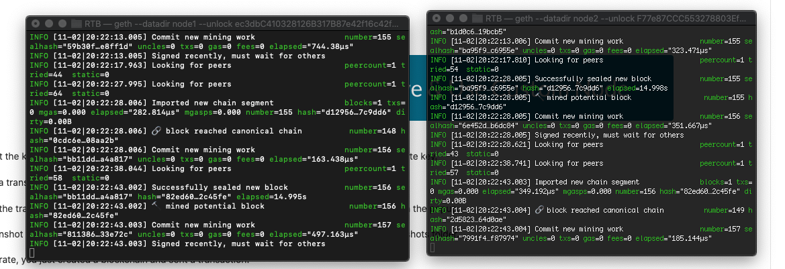
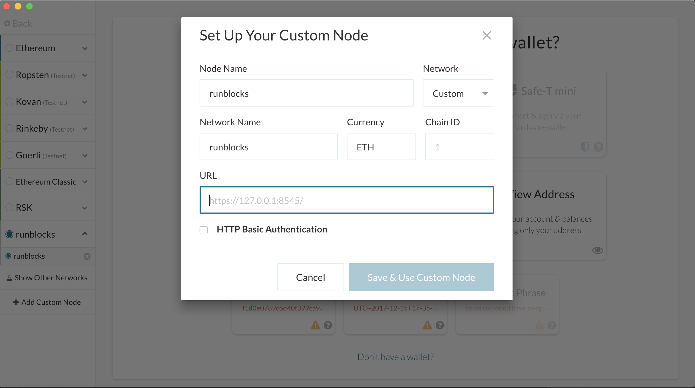
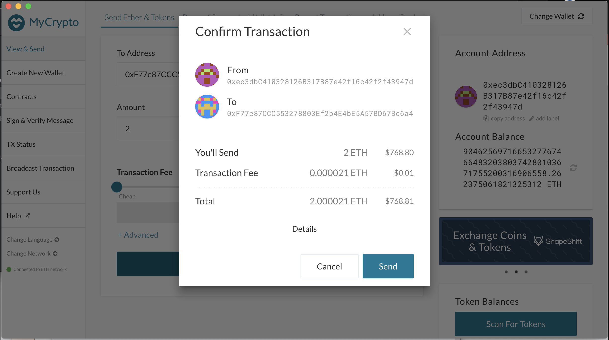
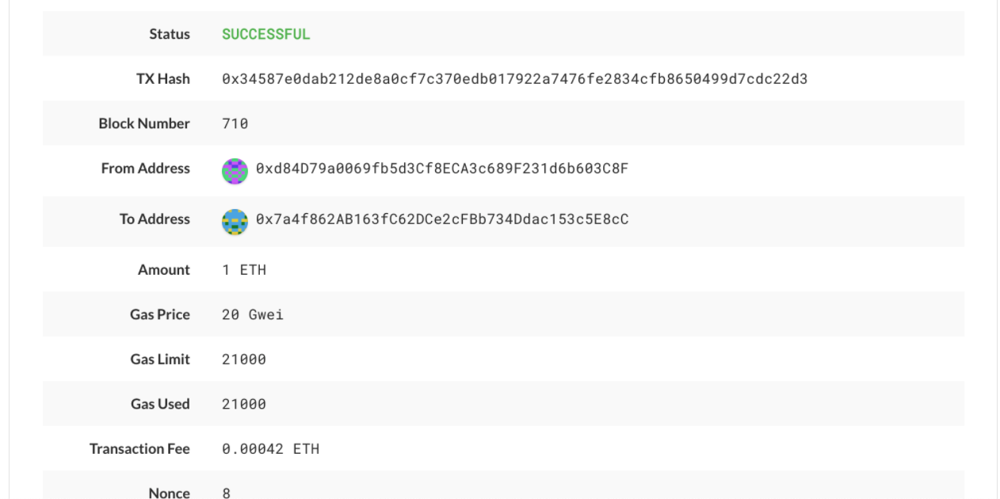

# Setting Up Blockchain
Creating an Ethereum testnet with a Proof-of-Authortiy (POA) Consensus Algorithm

## Creating File Directories (Instructions for Users with Mac OS X)
1. After creating a master directory that includes Geth and all other tools, enter the following into the terminal prompt from said directory: ./geth --datadir node1 account new
2. Repeat previous instruction for every node. In this example, I have only created two nodes
3. Save the account addresses generated in this process (account addresses begin with '0x')

## Creating a Genesis Block with Puppeth
1. In Terminal enter the following prompt to run puppeth: ./puppeth
2. Name your network (My example network is named 'runblocks')
3. Select the option to configure a new genesis block
4. Choose the Clique (POA) algo
5. Paste the account addresses generated in the prior section in both the Sealed addresses and Pre-funded accounts prompts
6. Complete remaining promts as desired
7. Once completed, select manage existing genesis and export genesis configurations.
9. The terminal will look similar to this at the end of this stage: 

## Setting Up the Nodes for Mining
1. Initializing the first node for mining in your Terminal: ./geth --datadir node1 --unlock "**Node 1 address here**" --mine --rpc --allow-insecure-unlock
2. Find and copy the enode address generated in the first step and copy it to your notes for the initialization of Node 2.
3. Initializing the second node for mining in your Terminal(second terminal window): ./geth --datadir node2 --unlock "**Node 2 address here**" --mine --port 30304 --bootnodes "enode://**node 1 endode address here**" --ipcdisable --allow-insecure-unlock
4. Once mining, the two terminal windows should look something like the following: 

## Connecting to MyCrypto
1. To connect your new blockchain to the MyCrypto wallet, you will open the app and select "Add Custom Node" from the network selection options. From there, you will fill out the prompt that looks as follows: 
2. In said prompt, you will enter the node name, network name and chain ID as selected in the creation of the Genesis block. Select ETH as currency and enter the URL for the network.

## Testing with a Transaction
1. Using the keystore file created in the directory creation step, unlock the wallet for node 1 with "Keystore File" authentication
2. Make a payment to the node 2 account via the public key generated in the directory creation step. 
3. Verify the payment via "TX Status"
4. A successful transaction should look similar to the following: 

