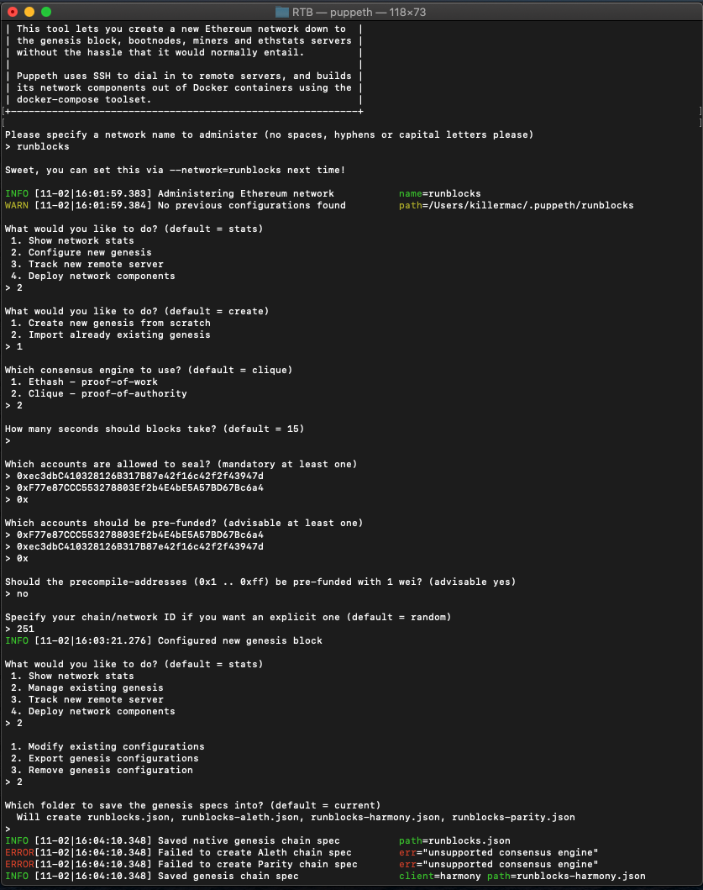

# Setting Up Blockchain
Creating an Ethereum testnet with a Proof-of-Authortiy (POA) Consensus Algorithm

## Creating File Directories (Instructions for Users with Mac OS X)
1. After creating a master directory that includes Geth and all other tools, enter the following into the terminal prompt from said directory: ./geth --datadir node1 account new
2. Repeat previous instruction for every node. In this example, I have only created two nodes
3. Save the account addresses generated in this process (account addresses begin with '0x')

## Creating a Genesis Block with Puppeth
1. In Terminal enter the following prompt to run puppeth: ./puppeth
2. Name your network (My example network is named 'runblocks')
3. Select the option to configure a new genesis block
4. Choose the Clique (POA) algo
5. Paste the account addresses generated in the prior section in both the Sealed addresses and Pre-funded accounts prompts
6. Complete remaining promts as desired
7. Once completed, select manage existing genesis and export genesis configurations.
9. The terminal will look similar to this at the end of this stage: 
